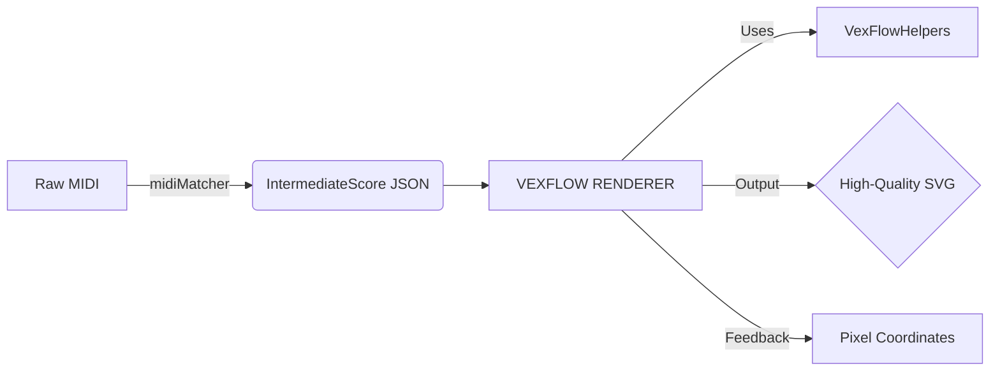

# DreamFlow MIDI-to-Sheet Music Pipeline

This document explains how to generate professional-quality sheet music from raw MIDI data using the **DreamFlow** library (a custom VexFlow fork). This pipeline is designed for high-fidelity rendering, providing frame-accurate coordinate tracking for animations and visualizers.

---

## 1. Pipeline Architecture (Order of Operations)

To achieve high-quality results, follow this sequential flow:

### Phase 1: Semantic Translation (MIDI → JSON)
- **Input**: Raw JavaScript objects representing MIDI notes (Pitch, StartTime, Duration, Velocity).
- **The Bridge (`midiMatcher.ts`)**: Use the `midiNumbersToVexKey` mapping to translate MIDI numbers (e.g., `60`) into VexFlow pitch strings (e.g., `"c/4"`). This is where you handle accidental preferences (Sharps vs. Flats).
- **The Result**: A JSON object that satisfies the **`IntermediateScore`** interface.

### Phase 2: Visual Orchestration (JSON → SVG)
1.  **Component Initialization**: Pass the JSON score to the `<VexFlowRenderer score={myScore} />` component.
2.  **Font Preloading**: The renderer ensures **Bravura** is loaded before its first draw.
3.  **Heuristic Processing (`VexFlowHelpers.ts`)**: The renderer automatically applies high-quality formatting:
    - **Heuristic Tuplet Detection**: Detects hidden triplets from MIDI timing.
    - **Grace Note Attachment**: Separates small decorative notes from the main beat alignment.
    - **Stem Direction**: Orchestrates up/down stems for multi-voice synchronization.
4.  **Format & Drawing**: The renderer synchronizes Treble and Bass staves for perfect vertical alignment and draws the final SVG path data.
5.  **Coordinate Extraction**: The renderer provides precise pixel locations for every note, enabling synced waterfalls or visual keyboard features.

---

## 2. Mandatory Files for Drop-in Integration

If you are building a new MIDI-only app, you only need to copy these 5 files:

| File Path | Purpose |
| :--- | :--- |
| **`src/lib/score/IntermediateScore.ts`** | **The Contract**: Defines the JSON schema that the renderer expects. |
| **`src/lib/score/midiMatcher.ts`** | **The Bridge**: Maps MIDI numbers to sheet music pitch strings. |
| **`src/components/score/VexFlowRenderer.tsx`** | **The Engine**: The React component that orchestrates the SVG render. |
| **`src/components/score/VexFlowHelpers.ts`** | **The Heuristics**: Handles formatting, tuplets, and grace notes. |
| **`src/lib/types.ts`** | **The Foundation**: Shared TypeScript types for score metadata. |

---

## 3. Implementation Checklist

- [ ] **Generate Persistence IDs**: Every note in your `IntermediateScore` should have a unique `vfId` (e.g., `note-123`). This keeps your UI stable during re-renders.
- [ ] **Bake Velocities**: Save the raw MIDI velocity in your JSON to allow the renderer to color notes based on intensity (pp, f, etc.) if needed.
- [ ] **Handle Bravura Text**: For tuplet numbers or text annotations, the renderer will automatically apply scaling to match professional engraving standards.
- [ ] **Listen for `onRenderComplete`**: Use this callback to retrieve the `beatXMap` and `measureXMap` coordinate data for your visualizer.

By separating the **MIDI-to-JSON** translation from the **JSON-to-SVG** rendering, you gain 100% control over both the musical theory and the visual aesthetic.
